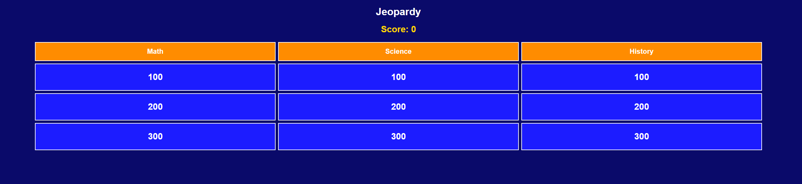

# Single-Player Jeopardy Game

## Overview
This is a simple, browser-based Jeopardy-style quiz game.  
Players can select questions from different categories, view them in a popup, and track their score. This version is **single-player** and runs entirely in the browser — no backend required.

---

## Screenshot

  
*Example view of the game board with categories and score.*

---

## Repository Structure

```text
Jeopardy/
│
├── index.html # Main HTML page for the game
├── style.css # Styles for the game board, tiles, modal, and score
├── script.js # JavaScript logic for category headers, tiles, modal, and score
├── screenshot.png # Screenshot of the game
└── README.md # Project documentation
```


---

## How to Play

1. **Clone or download** the repository.
2. Open `index.html` in any modern browser (Chrome, Firefox, Edge, etc.).
3. The game board will appear with categories and point tiles.
4. Click a tile to view the question in a popup modal.
5. Your **score** will update automatically based on the tile’s value.
6. Close the modal to return to the board and select another tile.
7. Repeat until all tiles are used.

---

## Features

- Multiple categories with headers
- Point-based question tiles
- Modal popup for questions
- Player score tracking
- Easy to extend with new questions or categories

---

## Future Improvements

- Reveal correct answer
- Deduct points for incorrect answers
- Reset game functionality
- Multiplayer support
- Timer for each question
- Enhanced styling and animations

---

## Contributing

1. Fork the repository.
2. Create a new branch for your feature or fix.
3. Make your changes.
4. Submit a pull request with a clear description.

---

## Tech Stack

- HTML
- CSS
- Vanilla JavaScript

---

## License
This project is open-source. You can use, modify, and distribute it freely.
